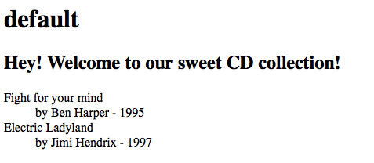
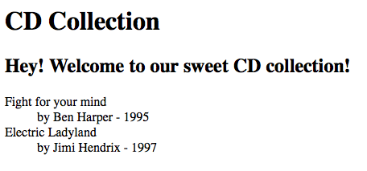

.. ==================================================
.. FOR YOUR INFORMATION
.. --------------------------------------------------
.. -*- coding: utf-8 -*- with BOM.

.. include:: ../../Includes.txt

A basic transformation
^^^^^^^^^^^^^^^^^^^^^^

Let's explain some of the basic features of the XSLT content object
like loading the XML and XSL data and starting a transformation. We
have the following XML in a file in our fileadmin folder:

.. code-block:: xml

   <?xml version="1.0"?>
   <collection>
        <cd>
                <title>Fight for your mind</title>
                <artist>Ben Harper</artist>
                <year>1995</year>
        </cd>
        <cd>
                <title>Electric Ladyland</title>
                <artist>Jimi Hendrix</artist>
                <year>1997</year>
        </cd>
   </collection>

During page generation, we want to load the XML and transform it to
the following HTML:

.. code-block:: html

   <h1>CD Collection</h1>
   <h2>Hey! Welcome to our sweet CD collection!</h2>
   <dl>
    <dt>Fight for your mind</dt>
    <dd>by Ben Harper - 1995</dd>
    <dt>Electric Ladyland</dt>
    <dd>by Jimi Hendrix - 1997</dd>
   </dl>

Using the XSLT content object, this is pretty straightfoward. First we
configure the source:

::

   page.10 = XSLT
   page.10 {
        source = fileadmin/collection.xml
   }

Next, we need to load the XSL styles that will perform the
transformation. The XSLT object gives you the possibility to define a
transformation 'pipeline', each with it's own configuration and
stylesheet through which the XML data gets send. Transformations are
configured below the  **transformation.** Property. We proceed:

::

   page.10 = XSLT
   page.10 {
       source = fileadmin/collection.xml
           transformations {
                   1 {
                           stylesheet = fileadmin/collection.xsl
                   }
           }
           stdWrap.wrap = 
 | 

   }

The stylesheet subproperty fetches the XSL styles from the specified
file. If everything is ok, the XSLT processor is started and runs
through all configured transformation steps. The final result is
passed to stdWrap, like you can see above. Here's the XSL stylesheet:

.. code-block:: xml

   <xsl:stylesheet version="1.0" xmlns:xsl="http://www.w3.org/1999/XSL/Transform">
   
    <xsl:param name="pagetitle" select="'default'"/>
    <xsl:output method="html" encoding="utf8" indent="no"/>
           
    <xsl:template match="collection">
     <h1><xsl:value-of select="$pagetitle" /></h1>
     <h2>Hey! Welcome to our sweet CD collection!</h2>
     <dl>
     <xsl:apply-templates/>
     </dl>
    </xsl:template>
           
    <xsl:template match="cd">
     <dt><xsl:value-of select="title"/></dt>
     <dd>by <xsl:value-of select="artist"/> - <xsl:value-of select="year"/></dd>
    </xsl:template>
   
   </xsl:stylesheet>

And here is the output:

Nice. But wait... what's that “default” thingy doing within the <h1>?
When we check the stylesheet, we see that the plan seems to have been
to set the content of the <h1> dynamically using a <xsl:param>. We
will fill in the title of the current TYPO3 page. For this, we simply
register the defined param in our TypoScript and process it's value
with stdWrap:

::

   page.10 = XSLT
   page.10 {
      source = fileadmin/collection.xml
           transformations {
                   1 {
                           stylesheet = fileadmin/collection.xsl
                           setParameters {
                                   pagetitle.value.data = page : title
                           }
                   }
           }
           stdWrap.wrap = 
 | 

   }

Output:

Ah, that's better ;)