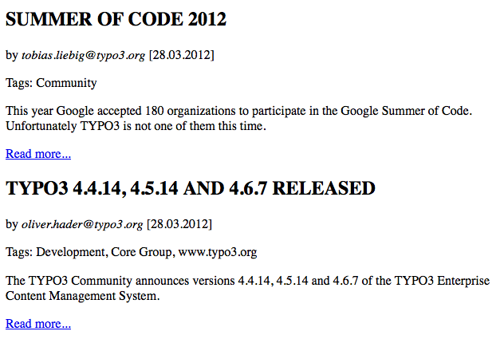
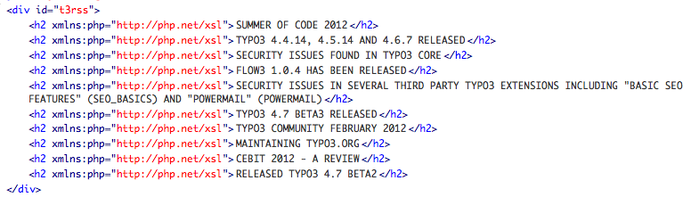
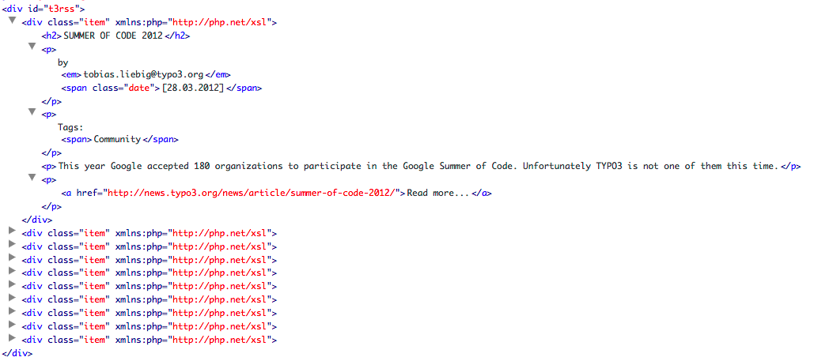

.. ==================================================
.. FOR YOUR INFORMATION
.. --------------------------------------------------
.. -*- coding: utf-8 -*- with BOM.

.. include:: ../../Includes.txt

Transform & display an external RSS feed
^^^^^^^^^^^^^^^^^^^^^^^^^^^^^^^^^^^^^^^^

Its a quite common task to display content from an external XML feed.
There are many good extensions in TER for this. The XSLT
content object can also step up to this as a pure TypoScript solution.

This tutorial will also show you how you can set parameters from
TypoScript for use in your XSL stylesheet or pass values from the XSL
stylesheet to TypoScript objects. On top of that there will be a
little demonstration of what stuff you can achieve by setting up an XSLT
pipeline. But let's check the newsfeed from
http://news.typo3.org/rss.xml first.

.. code-block:: xml

   <item>
        <title>FLOW3 1.0.3 has been released</title>
        <link>
                http://news.typo3.org/news/article/flow3-103-has-been-released/
        </link>
        <description>
                FLOW3 1.0.3, the third patch release of the PHP application framework has been          released.
        </description>
        <category>Development</category>
        <category>FLOW3</category>
        <category>www.typo3.org</category>
        <pubDate>Sat, 25 Feb 2012 21:30:00 +0100</pubDate>
   </item>

This is the XML structure for one news item.

We begin by loading the source and the XSL stylesheet:

::

   page.10 = XSLT
   page.10 {
      source = http://news.typo3.org/rss.xml
        transformations {
                1 {
                        stylesheet = fileadmin/t3news.xsl
                }
        }
        stdWrap.wrap = 
|

   }

Our stylesheet starts out with:

::

   <xsl:stylesheet version="1.0"
     xmlns:xsl="http://www.w3.org/1999/XSL/Transform"
     xmlns:php="http://php.net/xsl">

     <!-- set output format -->
     <xsl:output method="html" encoding="utf8" indent="yes"/>

     <!-- suppress any non matched text/atts -->
     <xsl:template match="text()|@*"/>

     <!-- root node -->
     <xsl:template match="/">
       <xsl:apply-templates />
     </xsl:template>

     <!-- processing of news items -->
     <xsl:template match="item">
       <xsl:copy-of select="." />
     </xsl:template>

   </xsl:stylesheet>

Basically, all the XSL does is to suppress any non-matched text and
attribute nodes and then select everything below and <item> node. When
the page is reloaded, we can already see the fetched news items from
typo3.org, though still in XML. Now let's spend a minute on thinking
what we want:

First we want the <title>s of each item to be capitalized. Next, we
want to display the author of the item (if there is one) and the date
of publication. Then we want to set a paragraph that contains a
collection of all <category> tags, separated with commas. Then follows
the <description> and finally a “Read more” link that leads straight
to the original article on typo3.org.

Though many things could be achieved with XSL alone, we will make
quick use of PHP functions and TypoScript objects in this tutorial to
demonstrate the functionality of the XSLT object. Titles first: We
will use PHP's strtoupper function for achieving this. Before we can
use PHP functions within our stylesheet, we have to register them in
the XSLT content object. For ease of use, we just register everything
by setting

::

   transformations {
       1 {
               stylesheet = fileadmin/t3news.xsl
                registerPHPFunctions = 1
       }
   }

Now we can modify the stylesheet and call PHP functions:

.. code-block:: xslt

     <!-- processing of news items -->
     <xsl:template match="item">
       <h2><xsl:value-of select="php:functionString('strtoupper', title)"/></h2>
     </xsl:template>

Dadaa, the result:

This can be taken further. Looking at the <pubDate>, we see that this
is not the format we want for display. We just want a simple
DD.MM.YYYY notation. What to do? Let's use a combination of PHPs
strtotime and strftime functions to first convert the textual date to
a unix string and the the unix string to a reformatted date (silly, I
know ... but it works ;)

.. code-block:: xslt

   

        
                [<xsl:value-of select="php:functionString('strftime', '%d.%m.%Y' ,php:functionString('strtotime', pubDate))"/>]
        
   

Next in stack is to match the <author> tag and put this in front of
the date, but only if its there. Simple job for XSL:

.. code-block:: xslt

   <xsl:if test="author">
           by <em><xsl:value-of select="author"/></em>
           <xsl:text disable-output-escaping="yes"> </xsl:text>
   </xsl:if>

Now we're up for <category> collection. This is also a XSL classic:

.. code-block:: xslt

   

           Tags:
           <xsl:for-each select=".//category">
                   <xsl:value-of select="."/>
                   <xsl:if test="position() != last()">
                           <xsl:text>, </xsl:text>
                   </xsl:if>
           </xsl:for-each>
   

The for-each construct iterates over all matched <category> tags, we
then append a comma, but only of this is not the last element of the
returned stack. Now for the description:

.. code-block:: xslt

   
<xsl:value-of select="description"/>

So far so good. The last bit gets interesting again. Here we want to
construct a link, but this time not using XSL but typolink to stay in
line with TYPO3s internal link handling. We therefore need to pass the
content of the <link> tags to a typoscriptObjectPath. Please remember
that you need to have PHP functions registered for this functionality.
We already did this so lets go:

.. code-block:: xslt

   <xsl:value-of select="php:functionString('\ADWLM\CobjXslt\ContentObject\XsltContentObject::typoscriptObjectPath', 'lib.link', link)" disable-output-escaping="yes"/>

Instead of calling standard PHP core functions, we can also call
static functions from our classes. TyposcriptObjectPath is called
statically for the XsltContentObject class. The second parameter adresses
which TypoScript object should treat the incoming values of our XPATH
(the third parameter). Don't forget to set disable-output-escaping,
otherwise any HTML generated from TypoScript will be escaped. Within
our TS Template, the link library looks like this:

::

   lib.link = TEXT
   lib.link {
     value = Read more...
     typolink.parameter.data = current : 1
     wrap = 
|

   }

Result:

You can find the full XSL stylesheet of this tutorial in the Resources/Public/Xsl
folder of the extension. One last thing: You may notice that all tags
generated during this transformation still carry the php namespace due
to our declaration in the stylesheet root. This could be suppressed
with  **exclude-result-prefixes="php"** .

But to show you another nice feature, we will not use this but pipe
the result of our first transformation into a second transformation
that takes care of this. `http://wiki.tei-c.org/index.php/Remove-
Namespaces.xsl <http://wiki.tei-c.org/index.php/Remove-
Namespaces.xsl>`_ has a convenient XSL stylesheet that does precisely
such jobs. This is how it is configured:

::

   page.10 = XSLT
   page.10 {

     source = http://news.typo3.org/rss.xml

     transformations.1 {

       stylesheet = fileadmin/t3rss.xsl
       registerPHPFunctions = 1
       stdWrap.wrap = 
|

     }

     transformations.2 {
       stylesheet = fileadmin/Remove-Namespaces.xsl
     }

   }

Finished. Now everything is nice and clean.