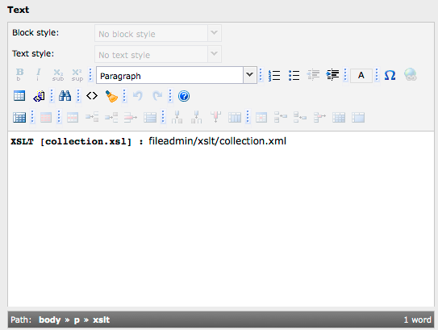

.. ==================================================
.. FOR YOUR INFORMATION
.. --------------------------------------------------
.. -*- coding: utf-8 -*- with BOM.

.. include:: ../../Includes.txt

<xslt> TypoTag
^^^^^^^^^^^^^^

From a developers point of view using the XSLT content object in a
TypoScript template or in a FLUIDTEMPLATE is perfectly fine. But
imagine you have some power users that work with XML and XSLT and want
to upload and transform their stuff themselves. How could the cObject
be made “reusable” and accessible for editors? Writing a small
extension comes to mind immediately. Or maybe introducing a new
content element. In this tutorial, we will look at another possibility
that is quite flexible and convenient: a <xslt> TypoTag. It will look
like this:

This is the source when the RTE is disabled:

::

   <xslt stylesheet="collection.xsl">fileadmin/xslt/collection.xml</xslt>

Optionally for our editors we could provide a userElement:

.. figure:: ../../Images/manual_html_60d7b4cd.png

The obvious advantage of a TypoTag in comparison to the other
approaches is that it can be used everywhere in the system. You could
also use it in a news record or an address element. Only an input
field is needed that is treated with the good old
lib.parseFunc/lib.parseFunc\_RTE. Let's configure the RTE with
PageTSConfig for our XSLT custom tag:

::

   RTE.default {
   
           showButtons := addToList(user)
           hideButtons := removeFromList(user)
   
           userElements {
                   747 = XML Functions
                   747 {
                           10 = XPATH
                           10.description = Executes a XPath query
                           10.mode = wrap
                           10.content = <xpath>|</xpath>
                           
                           20 = XSLT
                           20.description = Executes a XSLT transformation
                           20.mode = wrap
                           20.content = <xslt>|</xslt>
                   }
           }
   
           proc {
                   allowTagsOutside := addToList(xslt)
                   allowTags := addToList(xslt)
                   entryHTMLparser_db {
                           htmlSpecialChars = -1
                           allowTags := addToList(xslt)
                   }
           }
   }

We add the custom <xslt> tag to the various allowedTag lists in the
default configuration of the RTE. This makes it possible to enter the
tag directly without switching off the editor. The configuration of a
XML section in the userElements is optional and included here just for
completeness. Notice: If you use this, you will have to implement the
parsing of the custom tag slightly different than shown below, because
its not possible to set tag attributes in the userElements dialogue.

Next we need to configure lib.parseFunc and lib.parseFunc\_RTE for FE
rendering of our tag:

::

   lib.parseFunc {
     allowTags := addToList(xslt)
   }
   
   lib.parseFunc_RTE {
     allowTags := addToList(xslt)
   }
   
   lib.parseFunc.tags.xslt = XSLT
   lib.parseFunc.tags.xslt {
   
     breakoutTypoTagContent = 1
     stripNL = 1
   
     source.data = current : 1
   
     transformations.1 {
       stylesheet.dataWrap = fileadmin/xslt/|{parameters : stylesheet}
       setProfiling = 1
     }
   }
   
   lib.parseFunc_RTE.tags.xslt < lib.parseFunc.tags.xslt

First we added the <xslt> tag to the allowTags lists of both parsing
libraries. Then we configured the tag itself. Notice that its
important to set the breakoutTypoTagContent property, otherwise you
will have 
s wrapped around your result. Another thing to remember
is that it is possible to get the attribute values of custom tags with
getText from the $cobj->parameters array. Because the stylesheet
property has stdWrap capabilites we can use a dataWrap to set a basic
path to the XSL stylesheets and just let the users enter the needed
stylesheet. And that's it. Now you have a fully fledged XSLT object at
your editor's fingertips.

All that is left is to improve the display of the tag in the RTE like
in the screenshot above. This is of course optional. For the example
above we inserted the following CSS rule in a custom RTE stylesheet:

::

   xslt:before {
           content: "XSLT ["attr(stylesheet)"] :";
           display: inline-block;
           padding: 0 0.5em 0 0;
           font-family: monospace;
           font-weight: bold;
   }

The RTE normally will not display any tag attributes. But in our case
it can be helpful to see which stylesheet is set. This can be achieved
with pure CSS using the :before pseudo-selector and the content
property in combination with CSS's attr() function.